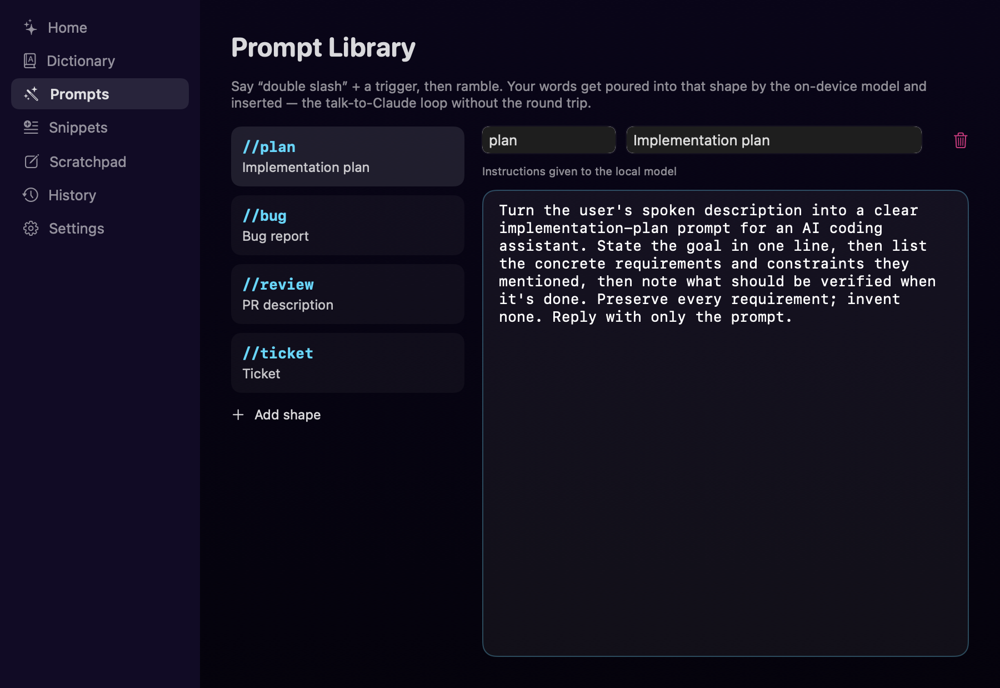

<div align="center">


# Waveform

**Local-first dictation for macOS 26.** Speak anywhere, get clean text at your cursor.
Transcription, cleanup, and AI rewriting all run **on-device** — no cloud, no account,
no audio ever leaves your Mac.

</div>

**Flow:** hotkey → HUD appears → speak → live transcription → stop talking (it
auto-stops after silence) → cleaned text lands wherever your cursor is: Slack,
VS Code, a browser field, Notes, anywhere.

The HUD starts small and grows once it has words. It never takes focus from the
app you're typing into, and you can drag it anywhere — it remembers where.


The pill shows only the moving waveform while you speak — your words belong at
the cursor, not in a floating box. The ribbons carry the signal: orange rides
your voice, cyan stills if the recognizer stops understanding. On the pill:
**✕** discard · **✨** organize the text first (⌥-click builds a prompt) ·
**✓** insert exactly as spoken.

## Install

**Just want to use it?** Get `Waveform-<version>.dmg`, drag the app to
Applications, then **right-click it → Open** the first time. That right-click is
required because this build is signed with a locally-generated certificate
rather than a paid Apple Developer ID; macOS shows a warning it won't show
again. Then press the hotkey once and grant **Microphone** and **Accessibility**.

**Building it yourself** requires **macOS 26** on Apple silicon and Xcode
**Command Line Tools** (`xcode-select --install`). No Xcode needed.

```bash
git clone <repo-url> && cd Waveform
INSTALL=1 Scripts/build-app.sh     # also copies to /Applications
open /Applications/Waveform.app
```

Drop `INSTALL=1` to keep it local (`open build/Waveform.app`). Once a copy
exists in /Applications, later builds sync it automatically — two copies of a
menu-bar app is a foot-gun, since you'd fix something and then launch the stale
one.

The build script creates a local "Waveform Dev" signing certificate on first run (so macOS permission grants survive rebuilds — without it, every rebuild looks like a new app and permissions silently reset).

First launch:
1. Press the hotkey once (default: **tap fn 🌐** — tap to start, tap to stop, or
   **hold fn for 2+ seconds** to push-to-talk: release inserts immediately;
   other presets in Settings). If macOS also opens the emoji picker on fn,
   set System Settings → Keyboard → "Press 🌐 key to" → **Do Nothing**.
2. Grant **Microphone** when prompted.
3. Grant **Accessibility** (System Settings opens — toggle Waveform ON). Needed to insert text into other apps and for the fn / double-tap-Control hotkeys.
4. The first dictation may download the on-device speech model once (system-managed).

The menu-bar icon (waveform + mic) shows **live permission status** — if something isn't working, look there first: ✗ rows are clickable and open the right settings pane.

## The app window

Open Waveform (Applications, Spotlight, or the Dock) and the dashboard comes up;
the menu-bar icon → **Open Waveform…** does the same at any time. While the
window is open the app shows a Dock icon; close it and Waveform drops back to
being just a menu-bar icon. Launching at login does *not* pop the window.


Everything is local: the stats and history come from a capped file on your own
Mac, and clearing it means clearing it.




## Using it

- **Start/stop**: your hotkey (default **fn 🌐**: tap to start / tap to stop, or **hold 2+ seconds for push-to-talk** — release inserts immediately. Settings also offers ⌘X, ⌥Space, ⌃⌥D, F19, and **double-tap Control**). Using fn as a modifier (fn+arrows, fn+delete) never triggers it. Dictation also **auto-stops** after ~2.5s of silence once you've spoken (configurable / off).
- **The ✨ button** (most reliable): while the HUD is up, press ✨ instead of ✓ — your words get organized by the on-device model, then inserted. ⌥-click it to build a prompt instead of tidying a message. No speech recognition involved, so it can't be misheard.
- **AI commands** (on-device, free — requires Apple Intelligence enabled). Say a `//command` at the start and then ramble; the local model restructures everything after it:
  - **"double slash prompt"** — turns your ramble into a clean, organized prompt to paste into Claude/ChatGPT
  - **"double slash better"** (also `organize`, `structure`, `professional`, `shorter`, `concise`) — tidies a message
  - Say the command with **nothing after it** while text is selected, and it rewrites the selection in place
  - Natural phrasing ("make this message better, …") still works, but the `//command` form never misfires
  If the model is unavailable or the rewrite fails a sanity check, your words are inserted as spoken and the HUD says why — it can never silently do nothing.
- **Prompt library** — say `//plan`, `//bug`, `//review`, `//ticket` (or your own trigger) and then ramble; your words are poured into that shape by the local model and inserted. Editable in the Prompts tab.
- **Personal dictionary** — one term per line: names, jargon, acronyms. Biases recognition from the next dictation.
- **It learns your vocabulary.** Fix a word Waveform typed — "prom" → "prompt", "nestjs" → "NestJS" — and it notices, adds the correction to the dictionary, and stops making that mistake. Only the corrected word is stored, never what you were writing. Reviewable and clearable in the Dictionary tab.
- **Filler removal**: "um okay so basically…" → "Okay, so basically…". Toggleable.
- All settings save automatically — there is no Save button.

## Sharing a build

```bash
Scripts/release.sh        # → dist/Waveform-<version>.dmg
```

The disk image holds the app, an Applications shortcut, and setup notes.
Recipients need nothing installed. To drop the first-launch warning entirely,
sign with a real Apple Developer ID and notarize — no code changes required.

## Icon

The app mark — an audio waveform built from disco-ball mirror facets — is drawn
in code (`Sources/WaveformCore/Branding/DiscoIconView.swift`), not shipped as
bitmaps, so it stays crisp at every size. `Scripts/build-app.sh` regenerates
`Support/AppIcon.icns` automatically whenever that drawing changes.

```bash
.build/debug/Waveform --render-icon icon.png 1024   # preview one size
.build/debug/Waveform --export-iconset out.iconset  # all macOS sizes
.build/debug/Waveform --render-docs docs/images     # regenerate README images
.build/debug/Waveform --render-social docs/social-preview.png   # GitHub card
```

The GitHub social-preview card (`docs/social-preview.jpg`, 1280×640) is drawn
from the same mark. GitHub has no API for it — upload it under
**Settings → General → Social preview**.

The README images are generated by the app itself with **demo data**, so
screenshots stay current after a UI change and never contain real dictation
history.

## Verification harnesses (no permissions needed)

```bash
swift run waveform-tests                      # unit tests
/usr/bin/log show --last 5m --predicate 'subsystem == "com.ibrahim.waveform"'  # what a running copy is doing
.build/debug/Waveform --selftest              # end-to-end: say → SpeechAnalyzer → cleanup, with timings
.build/debug/Waveform --fm-check              # is the on-device LLM available?
.build/debug/Waveform --render-hud out.png    # render the HUD for design review
.build/debug/Waveform --render-settings out.png
```

(`swift test` runs zero tests under Command Line Tools — hence the executable runner.)

## Architecture

```
Sources/Waveform/            thin executable (main.swift, CLI flags)
Sources/WaveformCore/
  Hotkey/                     Carbon hotkey (combos) + CGEventTap on a dedicated
                              thread (bare-modifier double-tap), pure tested detector
  Audio/                      AVAudioEngine tap → converter → engine format; throttled levels
  Transcription/              TranscriptionEngine seam; AppleSpeechEngine
                              (SpeechAnalyzer, volatile+fast results, model kept hot,
                              contextual-strings dictionary bias)
  Cleanup/TextCleaner         conservative rules — never rephrases
  AICommands/                 CommandDetector (pure, tested) + LocalRewriter
                              (FoundationModels, guarded: timeout, preamble & length checks)
  Injection/TextInjector      AX insert (verified) → unicode typing; ⌘V as explicit option;
                              clipboard snapshot/restore, change-count guarded
  HUD/                        non-activating NSPanel (never steals focus), neon Canvas waveform
  Settings/                   UserDefaults-backed, save-on-change
  App/DictationCoordinator    state machine + silence watchdog
```

Idle cost is ~zero: no audio engine, no timers, no animation while not dictating. The one exception: the double-tap-Control preset keeps a listen-only event tap alive (microseconds per keystroke).

## What's built, and what isn't

Shipped and wired into the live pipeline:

| | |
|---|---|
| Self-correction resolution | "…at 5, no wait, 6pm" → "6pm" |
| Spoken formatting | "new paragraph", "bullet point", punctuation, "delete that" |
| Command mode on a selection | select text, speak an instruction, it's rewritten in place |
| Prompt library | `//plan`, `//bug`, `//review`, `//ticket` + your own shapes |
| Voice snippets | say a trigger, get the stored text |
| Dictionary auto-learn | fix a word by hand and it stops being misheard |
| History & scratchpad | local, capped, clearable |
| Per-app style | *partial* — punctuation and casing only, no tone yet |

Not built yet, roughly in the order I'd add them:

- **Undo the last insertion** — the app writes arbitrary text into other apps through three mechanisms and there's no way back but manual selection
- **Editable per-app rules** — `AppStyle` hardcodes bundle IDs; that should be a table you control
- **Custom hotkey recorder** — six fixed presets today; a free-form recorder
- **Streaming insertion** — words appear as you speak. The data is already split into finalized and volatile for it, but cleanup and commands need the whole transcript, so it has to be a mode
- **Auto-update, guided first run, a health tab** — permissions are the number-one failure mode and every failure today is a log line nobody reads

Deliberately not doing: **multiple languages** (English only, by choice) and **file/meeting transcription** (MacWhisper owns that; different job).

Worth stating plainly: local dictation is no longer rare — VoiceInk and Superwhisper are local too. What's unusual here is *zero setup*: riding macOS 26's own speech model and Apple Intelligence means no model downloads, no API keys, no Ollama, and a 2.6 MB app. Wispr Flow, by contrast, has no offline mode at all and uploads audio plus screenshots of your active window.
